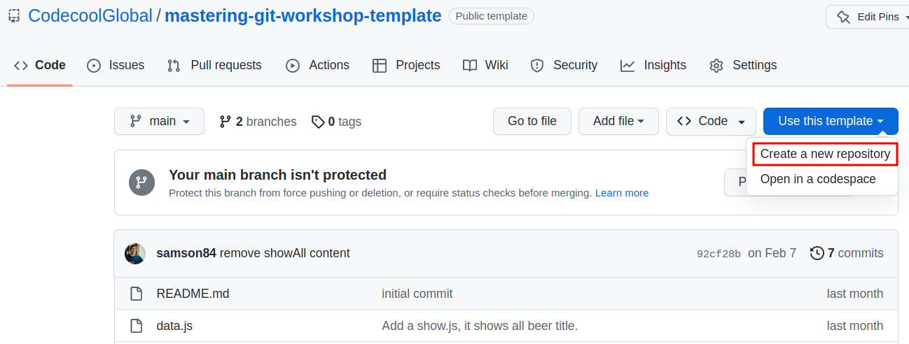
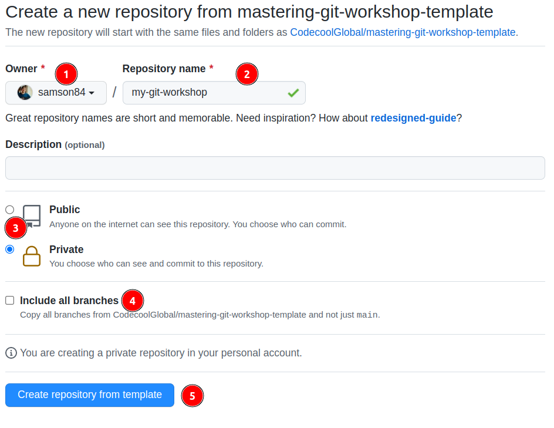
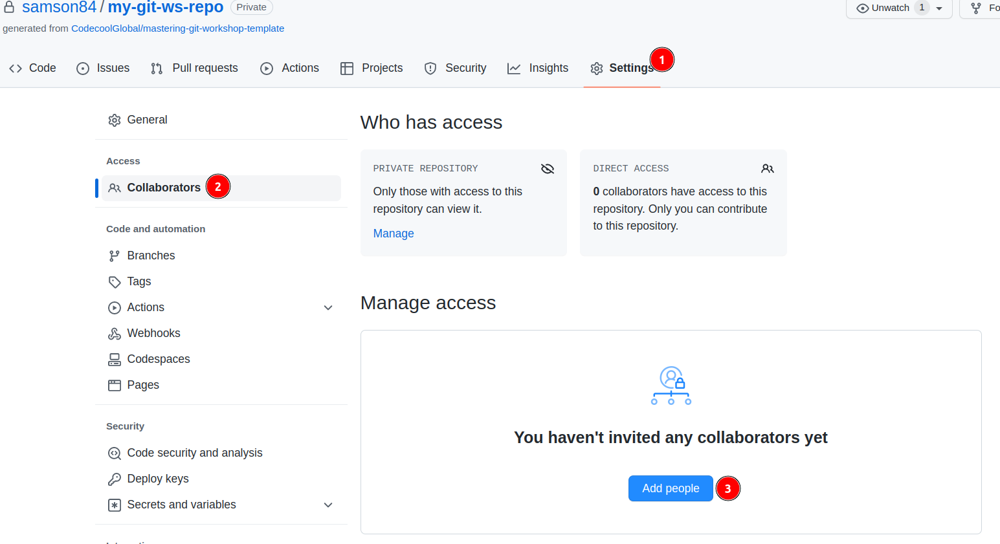

# Preparing 

Do the following steps to prepare the working environment
for this task. 

You will:

1. Create a new repo from the template
2. Invite your team mates to the repo
3. Clone the repository

## Create a new repo from the template

1. Select **Use this template**.
2. Select **Create a new repository**.

1. Select your Github account for the Owner.
2. You can name the repository as you want, it will be created with this name in your account.
3. You should choose **public** repo. The CI/CD tooling and GitHub Actions only working with public repos.
4. You can keep include all branches unchecked.
5. Click on the create repository

## Invite your peer to your new repo

Navigate to your newly created repo in your Github account.

1. Click to repo **Settings** tab.
2. Click to **Collaborators** on the sidebar.
3. Use the **Add people** button to add your team mates as a collaborator to your repo.
4. The team mates should accept the invitation (sent to them by GitHub notification or email).

## Clone the repository as usual

1. Clone your repo as usual.
2. When the team mates are accepted the invitation, they can clone the repo too.

